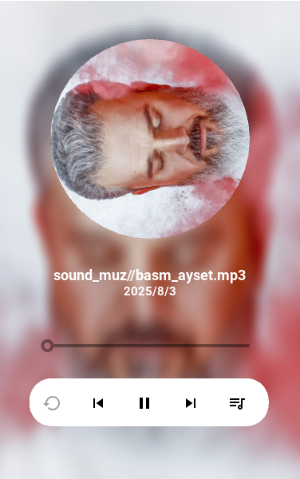
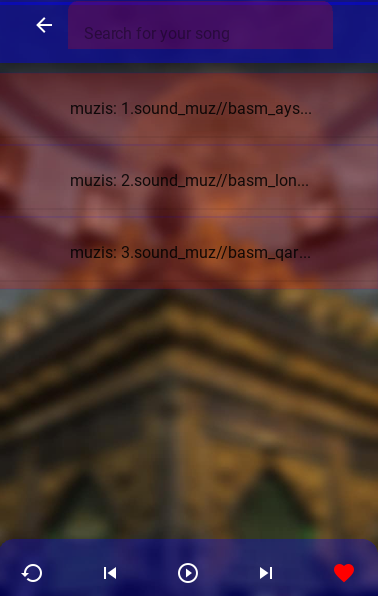

# 🎵 Music Player – Work in Progress

Experience a clean and modern *Music Player* with the following features:

- 🎧 *Play songs* from a playlist or your main favorites  
- 🔁 *Replay songs* easily  
- 🎶 Smooth and intuitive interface for enjoyable listening

⚠️ *Status:* Project is still under development

---

## 📸 Screenshots

### 🎵 Main Interface

### 🎶 Playlist View

---

## ✨ Features at a Glance
- Clean, modern, and intuitive design  
- Easy navigation between songs and playlists  
- Replay and favorite functionalities  
- Built with *Python & Kivy/KivyMD*  
- Fully expandable for future improvements

---

---

I can also make a full HTML version with colors, backgrounds, and hover effects to make it look like a real music app interface.

Do you want me to do that?

